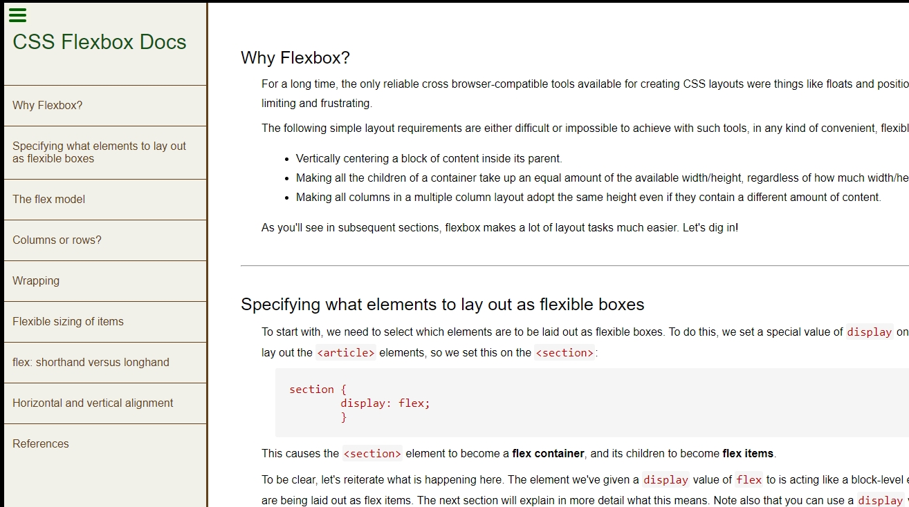

# Flexbox Dox

**A technical documentation page about CSS Flexbox using content from MDN .** 
A project built as part of the _Responsive Web Design_ course by freeCodeCamp (see other branch for submitted version).

Demonstrates typical features of tech docs like styling of code fragments and a navbar with links to section headings

---

### Visit Live Site

The master branch of this project is [deployed with Netlify](https://flexboxdox.netlify.app/)

---

### License

This project is licensed under the terms of the BSD 3-clause "New" or "Revised" license. 
